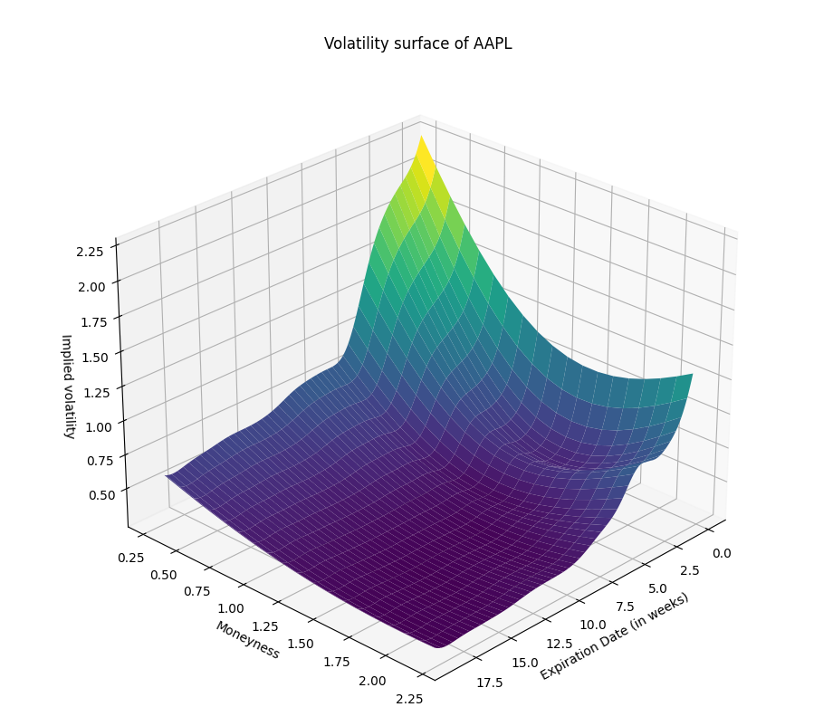

# Volatility Surface Modeling


## Overview

This project implements a sophisticated volatility surface modeling framework for financial option pricing. By extracting implied volatilities from market option prices and creating a three-dimensional interpolated surface, the model provides valuable insights into market expectations of future volatility across different strike prices and expiration dates.

## Features

- **Real-Time Data Retrieval:** Automatically fetches option chain data from Yahoo Finance
- **Implied Volatility Calculation:** Extracts volatility information embedded in market option prices
- **Surface Interpolation:** Implements advanced Radial Basis Function (RBF) to create smooth volatility surfaces
- **3D Visualization:** Generates interactive three-dimensional plots of the volatility surface
- **Customizable Parameters:** Allows adjustments to resolution, smoothing, and interpolation characteristics

## Example Output

<p align="center">

</p>

*Volatility surface for AAPL showing the implied volatility smile and term structure*

## Methodology

### 1. Data Collection
The system retrieves option chain data for any specified ticker symbol, covering multiple expiration dates to provide a comprehensive view of the term structure of volatility. Option data is cached to allow for offline analysis and historical comparisons.

### 2. Data Processing
- Converts implied volatility from percentage to decimal format
- Calculates moneyness (strike price divided by spot price) for standardized comparison
- Handles missing or invalid data points through intelligent interpolation

### 3. Surface Generation
The core algorithm employs a multi-step approach:
1. Initial grid creation using nearest-neighbor interpolation
2. Smoothing via Radial Basis Function (RBF) with customizable epsilon and smoothness parameters
3. Mesh grid generation for continuous surface representation

### 4. Visualization
The resulting surface is rendered as an interactive 3D plot showing:
- Expiration date (time dimension) on the X-axis
- Moneyness (strike/spot ratio) on the Y-axis
- Implied volatility on the Z-axis

## Applications

The volatility surface model serves multiple purposes in financial analysis:
- **Options Trading Strategy Development:** Identifies mispriced options based on deviations from the surface
- **Risk Management:** Quantifies volatility risk exposure across different segments of a derivatives portfolio
- **Scenario Analysis:** Projects option pricing under different volatility regimes
- **Market Sentiment Analysis:** Interprets skew and term structure as indicators of market expectations

## Usage

```python
# Basic usage with default parameters
plot_volatility_surface()

# Custom analysis with specified parameters
plot_volatility_surface('TSLA', resolution=5, epsilon=4, smooth=4)
```

## Parameters

- **ticker:** Stock symbol to analyze (default: 'AAPL')
- **resolution:** Grid density for surface interpolation (default: 10)
- **epsilon:** Shape parameter for the radial basis function (default: 1)
- **smooth:** Smoothing factor for the interpolation (default: 2)

## Dependencies

- pandas
- numpy
- matplotlib
- scipy
- yahoo_fin
- yfinance

## Future Enhancements

- Local volatility model calibration
- Stochastic volatility model integration
- Historical surface analysis and evolution tracking
- Volatility surface arbitrage detection algorithms